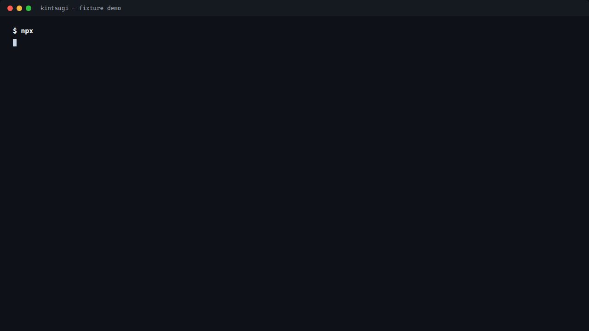
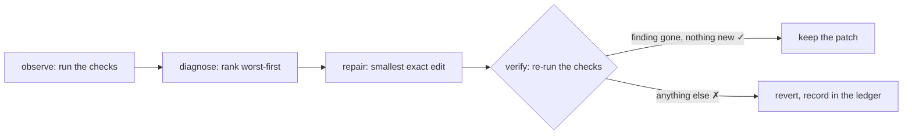

<div align="center">

#  Kintsugi

**A self-healing repair loop for codebases — packaged as a Claude skill.**

Your checks fail, you fix the symptom, the same defect drifts back in next
month. Kintsugi runs the loop instead: it observes the failures, repairs the
ones with a provably correct fix, **re-runs the checks to prove the repair
worked**, and quarantines the rest with evidence attached.

[](LICENSE)
[](https://github.com/Swastikbhat-lab/kintsugi/actions/workflows/ci.yml)
[](#)
[](#)
[](#)
[](#)
[](#)
[](https://github.com/Swastikbhat-lab/kintsugi/stargazers)
[](https://github.com/Swastikbhat-lab/kintsugi/graphs/contributors)
[](https://github.com/Swastikbhat-lab/kintsugi/issues)

</div>
<div align="center">



</div>

## The loop



Five phases, one creative phase. **observe** runs any check command and turns
its output into typed findings — `tsc` errors, TAP test failures, plain
`path: message` lines from your own scripts. **diagnose** ranks and consults
the ledger, which remembers every `fingerprint → patch → outcome` so dead
ends are never retried. **repair** proposes the smallest exact-string edit —
rules first, a model only when no rule reaches. **verify is the
load-bearing phase**: the patch is kept only if the finding is gone *and*
nothing new appeared. **settle** stops when nothing actionable is left.

This is the loop that once repaired web UI (contrast ratios, tap targets) —
generalized so it repairs anything with a measurable check, and packaged as
a Claude skill because the shape was always the point, not the domain.

## Quickstart

```bash
npm install && cd fixture && npm install      # once
npm run demo                                  # watch it repair a broken package, keyless
```

Point it at a real repo — from anywhere, once the skill is installed:

```bash
~/.claude/skills/kintsugi/scripts/run-loop.sh --source <your-repo> --dry    # survey: what WOULD it fix? writes nothing
~/.claude/skills/kintsugi/scripts/run-loop.sh --source <your-repo>          # rules-only, every patch verified
~/.claude/skills/kintsugi/scripts/run-loop.sh --source <your-repo> --watch   # keep repairing as it drifts
~/.claude/skills/kintsugi/scripts/run-loop.sh --source <your-repo> --git --push   # commit verified fixes on a branch, then push it
```

`--git` commits each verified fix on its own branch (it requires a clean
tree, so the loop's edits never mix with yours — review them with `git log
-p`); `--push` pushes that branch after the run, the pusher role, so the
verified fixes are one PR away.

`--watch` keeps the loop resident: it watches the repo for changes and runs a
pass a couple of seconds after each one settles, so a defect that drifts
back in is repaired on its own. The loop ignores its own writes, so a repair
never re-triggers itself; `--interval <secs>` adds a periodic re-check for
drift that doesn't touch files.

The script locates or bootstraps the engine (one-time clone + install at
`~/.kintsugi/engine`) and resolves relative paths against your repo, so it
works from any working directory against any codebase.

Exit code `0` when nothing actionable remains, `1` while defects do — so it
gates a pipeline. `--quarantined-ok` treats quarantine (a human decision)
as success.

## Install it as a Claude skill (or plugin)

```bash
mkdir -p ~/.claude/skills
cp -r skills/kintsugi ~/.claude/skills/kintsugi
```

Or run it as a **GitHub App** that reviews pull requests on any repo you
install it on — no workflow files to copy. Install the app once, get a
findings comment on every PR, and comment `/kintsugi-fix` to have the
verified repairs land as a new PR. Setup and deployment in [`bot/`](bot/README.md).

Or install the whole repo as a **Claude Code plugin** — the skill and the
agent fleet ship inside it:

```bash
claude plugin install Swastikbhat-lab/kintsugi
```

Claude Code (or any agent that reads skills) then knows the loop exists,
loads the instructions when checks fail, and runs the bundled engine via
`scripts/run-loop.sh`. The skill is progressive-disclosure shaped: ~100
tokens of frontmatter until a failing check triggers it. It ships its own
agent fleet too — the loop's roles (observer, researcher, planner,
tester, healer, critic, verifier, checker, overseer) are Claude Code
subagents, bundled at `skills/kintsugi/agents/` and installed user-wide
with one command:

```bash
~/.claude/skills/kintsugi/scripts/run-loop.sh --install-agents
```

Verify any install end-to-end without writing a byte to your repo —
`--selfcheck` boots the engine, probes the runtimes, and runs the bundled
fixture through the whole loop in dry mode:

```bash
~/.claude/skills/kintsugi/scripts/run-loop.sh --selfcheck
```

## Any check becomes an observation

The contract with a check is one sentence: **give me typed failures**. A
`kintsugi.config.json` in the target repo wires checks. With zero config the
engine detects the repo's toolchain and runs what its own scripts offer:

- **npm** — `typecheck` + `test` from `package.json` scripts
- **Python** — `py:test` (pytest) and `py:lint` (ruff), venv-aware; plus
  `py:bandit` (security) and `py:radon` (complexity) when those tools are
  installed, and `py:perf` / `py:best-practices` / `py:testgen` — the
  engine's own stdlib-only scanners, always on
- **Go** — `go:test` (`go test ./...`) and `go:vet` (`go vet ./...`)
- **Rust** — `rs:test` (`cargo test`) and `rs:lint` (`cargo clippy -D warnings`)
- **Mixed** repos get the union of their toolchains

The Python check set was harvested from the CodeGuardian review system:
its security/complexity/perf/best-practice detectors became strict-parseable
checks, its risk scoring and suppression became the prioritization layer
over the finding queue, its Langfuse tracing was rebuilt on *real* token
usage, and its test generator became a repair strategy — every fix still
proven by re-running the checks.

**Two engines, one loop.** The orchestrator is TypeScript (agent graph
concurrency, all languages); the **Python engine** (`py/`) is a faithful
port that needs no Node runtime at all — discovery, pytest/ruff/go runs,
the strict parser, the F401/I001/E7/assertion-constant rules, the verify gate,
the ledger, **watch mode** (polling-based), and the **model proposer**
(optional `anthropic` SDK, or `--llm-mock` for keyless runs) all run under
a plain `python` interpreter. A Python-only repo — no `package.json` — is
automatically dispatched to it. `run-loop.sh` picks the engine
automatically (or set `KINTSUGI_RUNNER=python|node`); invoke the Python
engine directly with `python -m kintsugi --source <repo>` from `py/`. The
two engines share the same ledger format, report shape, and exit-code
contract, so a repo audited by both keeps one memory. That interchangeability
is enforced by a CI regression test (`py/tests/test_parity.py`) that runs
*both* engines on the same fixture and asserts identical fingerprints,
reports, and exit codes, plus one shared ledger across engines.

**What we took from NOOA.** The model seam borrows two ideas from NVIDIA's
object-oriented-agents framework: **typed I/O with auto-retry** (a reply
that breaks the output contract is retried with the same prompt, its usage
accumulated; one corrective re-prompt when every proposed anchor fails) and
**model-callable context** (the proposer sees the ledger's prior attempts at
this finding and the file's importer count through the prompt, so it does
not rediscover dead ends or guess at blast radius — and it can *ask* the
harness for more through three declared read-only tools, `read_file`,
`grep`, and `importers`, executed by engine code with results returned as
bounded text, so the model can look without ever touching a live object or
running code). We deliberately did
*not* take code-as-action or live-object pass-by-reference — a model that
writes code against your repo is a model your verify gate cannot attribute.
[docs/NOOA.md](docs/NOOA.md) is the full capability map: what fits, what
does not, and why.

Every toolchain check is gated on a quick availability probe, so a repo
never gets a check whose tool is missing — a default check that crashes on
arrival would be a broken harness, not a defect. `--list-checks` shows what
would run. A repo with no detected toolchain, or one that needs something
specific, writes a config:

```jsonc
{
  "checks": [
    { "name": "typecheck", "command": "npm run typecheck", "parser": "tsc" },
    { "name": "test", "command": "npm test", "parser": "tap" },
    { "name": "version", "command": "npm run check:version", "parser": "lines" }
  ]
}
```

A custom check is a shell command that prints `path: message` lines. A check
that crashes with no output is a broken harness — reported, never healed.

## What it repairs

| Defect | Repair | How |
|---|---|---|
| Unused declarations (TS) | remove the dead line | rule |
| Unresolvable import paths (TS) | point at the real module | rule |
| Missing `export` keyword (TS) | add it (when the declaration exists) | rule |
| Stale version strings (npm) | replace from package.json | rule |
| Unused imports (Python `F401`, Go, Rust `use`) | remove the import line | rule |
| Unsorted import blocks (Python `I001`) | sort them isort-style | rule |
| Wrong constant behind a failing assertion (Python/Go/Rust `assert_eq!`) | recompute from the assertion's own numbers | rule |
| `type(x) == T`, `len(x) == 0`, `key in d.keys()` (Python `T201`/`T202`/`T203`) | rewrite to `isinstance`, truthiness, `in d` | rule |
| `x == None`, `x == True`, `not x in y`, `not x is y` (Python `E711`–`E714`) | rewrite to `is`/`is not`, `not in`, `is not` | rule |
| `type(x) == T` (Python `E721`) | rewrite to `isinstance(x, T)` — or the identity test when both sides are `type()` calls | rule |
| Functions with no tests (Python `T001`) | generate a smoke test next to the module, then run it | rule |
| Hardcoded secrets, shell usage (bandit), C+ complexity (radon), perf anti-patterns, TODOs/prints | — | scored, ranked, surfaced (quarantined with evidence) |
| Wrong behaviour behind a failing test | rewrite the code | model, then **verified** |
| Missing functions, missing features | — | quarantined with evidence |

## What it refuses to do

- **Ship unverified repairs.** The checks are re-run after every patch; the
  patch is kept only if the finding cleared *and* nothing new appeared.
- **"Heal" a crashed check.** A non-zero exit with no findings is a broken
  harness, not a defect.
- **Patch shared files silently.** A file two modules import is escalated
  with its importer count, because the verify gate cannot see the damage it
  does elsewhere. `--allow-shared` overrides; `--git` commits each verified
  fix separately.
- **Trust the model.** An LLM proposal is a proposal; the gate that decides
  is the re-run of the checks. `--llm-mock` replays proposals so the full
  path is demonstrable without a key.
- **Loop forever.** A finding with no untried candidates is quarantined with
  evidence for a human.

## The agent team

Each iteration deploys a small fleet of specialized roles. The loop's graph
runs them in dependency order — observers fan out concurrently, the model
seam steps run serially, three critic agents review the patch from fresh
contexts in parallel, and a single serial tail applies and verifies,
because two patches applied at once destroy the verify step's ability to
say which one caused what. See
[skills/kintsugi/GRAPH.md](skills/kintsugi/GRAPH.md).

| Role | Phase | What it does | In the engine |
|---|---|---|---|
| **observer** | observe | Runs one check; turns its output into typed findings | one graph node per check, concurrent |
| **researcher** | repair | Localizes the defect to the symbol and call chain that actually cause it — a file is where the symptom appears, a symbol is where the defect lives | `provider.localize()`, feeds the proposer |
| **planner** | repair | Turns the localization into a repair strategy and checks the blast radius before anyone codes | returned with the localization |
| **tester** | repair | Writes a failing repro test *before any repair* and confirms it is red — the repair's only job is to turn it green | `provider.reproduce()`, red-confirmed by re-running the checks |
| **healer** | repair | Proposes the smallest exact edit — rules first, a model only when no rule reaches | rules in `src/propose.ts`, then the model seam |
| **critic** | verify | Reviews the patch from three fresh angles: fixes the right thing? collateral damage? valid edit? | three concurrent graph nodes, majority vote |
| **verifier** | verify | Applies the patch and re-runs the checks: kept only if the finding is gone *and* nothing new appeared | the serial tail, `verifyPatch()` |
| **checker** | settle | One final whole-tree pass after all repairs — catches interactions between individually-verified fixes | `finalCheck()` after the loop |
| **overseer** | settle | The only role with the whole run: decides converge, escalate, or stop | the loop's settle + ledger |

Every role is also a Claude Code subagent, bundled at
`skills/kintsugi/agents/` and installed with `--install-agents`. The model
seam (researcher, planner, tester) only engages when the mechanical rules
can't reach a finding — rules are free, deterministic, and proven; the
model handles what they can't, and every model proposal still has to pass
the same mechanical gate.

## See it happen

`fixture/` is a deliberately-broken package with six planted defects across
four check domains. `npm run demo` repairs five of them — including a
deliberate wrong guess that the verify gate rejects and the ledger
remembers — and quarantines the sixth. The evidence from a real run is in
[docs/OVERVIEW.md](docs/OVERVIEW.md).

## What's next (honestly)

- **More rule classes** — the comparison-style family (`E711`–`E714`) and
  type comparison (`E721`) just landed in both engines; every other
  mechanically-fixable check (formatting, dead code, deprecations) is one
  more arm in `src/propose.ts`.
- **A live model run** — the Anthropic seam is built and degrades safely,
  but is only exercised through the mock so far.
- **A live Langfuse dashboard** — the tracer is proven end-to-end against
  the local mock (`demo/langfuse_mock.py`) with real SDK calls, usage, and
  audit; the only remaining gap is pointing it at a real project.

## Observability

Set `LANGFUSE_PUBLIC_KEY` / `LANGFUSE_SECRET_KEY` (optionally
`LANGFUSE_HOST`; default `https://us.cloud.langfuse.com` — use
`https://eu.cloud.langfuse.com` for EU projects, since the legacy
`cloud.langfuse.com` host rejects valid keys with a misleading 401) and
the loop traces
itself to Langfuse, mirroring the ledger's structure: one trace per run;
`observe`/`verify`/`settle` spans; and per-attempt `verify` spans carrying
the same fingerprint, patch shape, outcome, collateral, and provider fields
the ledger records — joinable on fingerprint + outcome. Model calls are
`generation` events with the usage the provider actually reported
(`KINTSUGI_INPUT_PRICE`/`KINTSUGI_OUTPUT_PRICE` default $5/$25 per 1M, for
cost), never fabricated numbers. Without keys, or without the `langfuse`
SDK, the tracer is an inert no-op and can never take the loop down.

**Audit a finished run from its trace** — `kintsugi --trace <traceId>`
(`npm run cli -- --trace <traceId>` for the TS engine) queries Langfuse,
joins each `generation`'s reported usage to the `settle` span's attempt
history by fingerprint, and prints a per-finding cost table
(fingerprint, finding, outcome, input/output tokens, cost) plus a total.
Multiple model calls for one finding accumulate into its row, and the
same prices used at trace time produce the same costs.

**The host matters too** — Langfuse now runs regional clouds and the
legacy `cloud.langfuse.com` 401s even valid keys. Kintsugi defaults to
the US regional host and honors `LANGFUSE_HOST` everywhere (the TS
client's own env var, `LANGFUSE_BASE_URL`, is deliberately ignored in
favor of the same contract both engines share).

**The SDK version matters — get this right or tracing silently no-ops.**
The tracer and the audit module each speak one specific `langfuse` API,
and *no single current release has both*: newer releases (3.x/4.x on
PyPI, `@langfuse/client` 5.x) dropped the tracer's
`trace/span/generation` methods, and the 2.x line lacks the audit's
`fields` query parameter. Pin the versions the code was built against:

- **Python engine**: `pip install 'langfuse~=2.60'` (or
  `pip install 'kintsugi-py[tracing]'`). Installing today's `langfuse`
  (4.x) makes the tracer silently inert — it would look like tracing
  works and post nothing.
- **TS engine**: both `langfuse` (≥3.38, the tracer) and
  `@langfuse/client` (≥5, the audit) are declared in `package.json`.

**Prove it locally without a Langfuse account** — `demo/langfuse_mock.py`
serves the two endpoints the SDKs actually call
(`POST /api/public/ingestion`, `GET /api/public/observations`), so the
real SDK posts real traces to it and the `--trace` audit reads them
back. Run it (`python demo/langfuse_mock.py 8787`), point the loop at it
(`LANGFUSE_HOST=http://127.0.0.1:8787`), and open
`http://127.0.0.1:8787/?trace=<id>` for a rendered viewer of the
ledger-joined trace.

**Audit locally, no service needed** — `kintsugi --audit-log <path>`
appends one NDJSON line per repair attempt (fingerprint, outcome,
check/code, patch rationale, provider, and the real token usage + cost
of the model calls made for that finding) plus a final summary line
with the run totals. Read it with any JSONL tool, or turn it into a
table with `jq -s`. The same usage numbers feed both this file and the
Langfuse trace, so they reconcile. Without the flag nothing extra is
written; a bad path degrades with one stderr note, never a crash.

## The point

Auto-fixers fail one way that matters more than all others: they apply
changes that look right and silently do nothing, or fix one thing by
breaking another. The fix isn't a better model — it's a loop that notices,
repairs, and **proves** the repair. Kintsugi is that loop, generalized
beyond the one domain it started in, and taught to any agent that can read.

---

<div align="center">

MIT licensed · [issues & ideas welcome](https://github.com/Swastikbhat-lab/kintsugi/issues) · [contributing](CONTRIBUTING.md)

⭐ Star it if your CI has ever gone red and nobody knew why.

</div>
